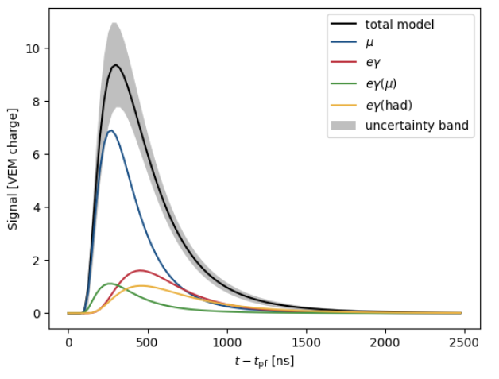

# NOTE
This version is for illustration/inspiration purposes only (And probably does not work since some data files
are not added). Contact me for help.

# Time Trace Templates

This packackge lets you fit Pierre Auger SD events with time trace templates to get an estimate of Xmax.\
Need python 3 with some packages (should be automatically installed)
Belongs to PhD thesis Mart Pothast 2022.

## Installation
Run `./install.sh` should install and set everything. Also installs some python requirements. Best to first
create a (conda) environment.

You need to specifiy a folder where you want to put some processed data files `data_path`

You need to set your offline/adst environment if you want to read ADST files, but this should not be necessary
if you have the processed root trees (read with uproot).

## Run
Just use `./run_ttt_fit.py`

With adst files `./run_ttt_fit.py -a dir/file1.root dir/file2.root` \
will create a root tree file in `data_path/trees/tree_file1.root` and also a pandas dataframe in a pickle file
in `data_path/df_tree_file1.pl` (note this contains all adst files, but the naming is just the first, you
can specify a custom key, see `-help`). The fitted data will be stored in
`data_path/fitted/df_events_fitted_file1.csv`, along with some event info (and as a bug/feature the mean of all
stations parameters)

With a (already processed) root tree file `./run_ttt_fit.py -t dir/tree_file.root` \
will also create a df pickle file

With pandas df file `./run_ttt_fit.py -df dir/df_tree_file.pl or .csv`

Test with `./run_ttt_fit.py --test` on 2 random golden hybrid events to check that you get the correct value (as reported
in thesis), handy if you change some code somewhere

Plot with `./run_ttt_fit.py --plot` (beware that this plots for every event and you have to close it by hand)

Can change plot options files with `./run_ttt_fit.py -options fit_options.json`. In `fit_event_options/` there are examples for json files that specify the fit options. Default is `sd_Xmax_fit.json`.

## Tutorial

Have a look at `tutorial_total_model.ipynb`, shows how to predict the time trace templates
